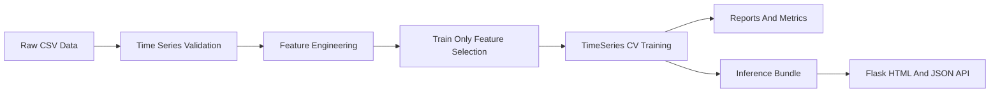

# Microgrid PV Production Forecasting

Data-quality-first photovoltaic (PV) forecasting pipeline for microgrid operations.

This project is designed as an applied data engineering and machine learning portfolio project. It focuses on reproducible time-series training, data validation, leakage-aware feature selection, model comparison, and a small inference service.

## What This Project Shows

- Time-series data validation for hourly PV datasets.
- Leakage-aware train/test handling and `TimeSeriesSplit` cross validation.
- Energy-domain feature engineering with lagged PV output, radiation trends, and daylight indicators.
- Config-driven model comparison across scikit-learn and gradient boosting regressors.
- Naive baseline benchmarking with lag-based PV predictions.
- Reproducible training artifacts for reports, selected features, model comparison, and inference.
- Docker-based training and a Flask service with HTML and JSON prediction endpoints.

## Dataset Snapshot

The repository expects raw CSV files under `data/raw/`.

| Split | Rows | Columns | Time Range |
| --- | ---: | ---: | --- |
| Train | 9,515 | 44 | 2020-01-01 13:00 to 2021-01-31 23:00 |
| Test | 841 | 44 | 2021-02-01 00:00 to 2021-03-08 00:00 |

The target column is `pv_production`. Weather and solar-position features include radiation, cloud cover, temperature, humidity, wind, `sun_azimuth:d`, and `sun_elevation:d`.

## Architecture



## Quick Start

```bash
python -m venv .venv
source .venv/bin/activate
pip install -e ".[dev]"
```

Run tests and static checks:

```bash
pytest
ruff check .
```

Run the canonical training pipeline:

```bash
python scripts/train_pipeline.py --feature-mode forecast_proxy --skip-plots
```

For a faster smoke run, train only one model:

```bash
python scripts/train_pipeline.py --feature-mode forecast_proxy --models ridge --skip-plots
```

Run the stricter history-only experiment:

```bash
python scripts/train_pipeline.py --feature-mode history_only --models ridge --skip-plots
```

Run the optional PyTorch LSTM smoke experiment:

```bash
python -m pip install -e ".[dl]"
python scripts/run_lstm_experiment.py --feature-mode history_only --epochs 20
```

The LSTM script is intentionally separate from the main pipeline. It is a small deep-learning benchmark for checking whether sequence modeling helps on this relatively small hourly dataset.

Start the web service after a model bundle has been created:

```bash
python -m src.web.app
```

Then open `http://127.0.0.1:5000/`, or call the JSON API:

```bash
curl http://127.0.0.1:5000/health
curl http://127.0.0.1:5000/metadata
```

Low-level model-feature prediction:

```bash
curl -X POST http://127.0.0.1:5000/predict \
  -H "Content-Type: application/json" \
  -d '{"features": {"pv_production_lag_1": 42, "hour": 12}}'
```

Production-style prediction with target time, historical PV, and weather forecast/API data:

```bash
curl -X POST http://127.0.0.1:5000/predict/weather \
  -H "Content-Type: application/json" \
  -d '{
    "target_time": "2026-05-24T12:00:00Z",
    "latitude": 52.52,
    "longitude": 13.41,
    "recent_pv": {
      "lag_1": 42,
      "lag_2": 39,
      "lag_3": 34,
      "lag_21": 22,
      "lag_22": 30,
      "lag_23": 36,
      "lag_24": 40
    }
  }'
```

If `weather_forecast` is provided in the request body, the service uses it directly. If weather features are required by the model and `weather_forecast` is not provided, the service uses latitude/longitude to fetch target-hour forecast values from Open-Meteo.

## Docker Usage

Build and run training:

```bash
docker compose build
docker compose run --rm train
```

Run the web service:

```bash
docker compose --profile web up web
```

## Main Artifacts

The training pipeline writes the following files:

- `reports/data_validation_report.json`: data quality checks for train, test, and split boundaries.
- `reports/selected_features.json`: train-only feature selection output and audit metadata.
- `reports/training_summary.json`: selected features, model metrics, and best parameters.
- `reports/benchmark_summary.csv`: naive baselines and trained models in one benchmark table.
- `reports/prediction_errors.csv`: row-level predictions, residuals, and diagnostic segment labels.
- `reports/error_analysis_by_ramp_phase.csv`: errors grouped by night, sunrise ramp-up, midday, and sunset ramp-down.
- `reports/error_analysis_by_weather_state.csv`: errors grouped by clear-sky-ratio weather states.
- `reports/error_analysis_by_radiation_bin.csv`: errors grouped by radiation intensity bins.
- `reports/error_analysis_by_hour.csv`: errors grouped by hour of day.
- `reports/lstm_experiment_summary.json`: optional PyTorch LSTM smoke-test metrics when `scripts/run_lstm_experiment.py` is run.
- `results/model_comparison_comparison.csv`: model comparison table.
- `results/model_comparison_pvalues.csv`: paired significance-test output.
- `results/benchmark_comparison_comparison.csv`: combined model/baseline benchmark with significance flags.
- `results/benchmark_comparison_pvalues.csv`: one-sided paired t-test p-values for models and baselines.
- `models/pv_inference_bundle.joblib`: trained pipeline and feature metadata for inference.

## Benchmarking Approach

The training pipeline evaluates simple lag-based baselines before training ML models:

- `NaiveLag1`: predicts the next value with `pv_production_lag_1`.
- `NaiveLag24`: predicts the next value with `pv_production_lag_24`, roughly yesterday's same hour.

These baselines answer an important review question: whether tuned ML models improve on simple operational rules. The combined benchmark is saved to `reports/benchmark_summary.csv` and also embedded in `reports/training_summary.json`.

The pipeline also compares trained models and baselines with paired one-sided t-tests on CV RMSEs. A lower RMSE is better, so each p-value answers whether the row model is significantly better than the column model or baseline. The output files are:

- `results/benchmark_comparison_comparison.csv`: includes `Significantly Beats Any Baseline` and `Significantly Beats All Baselines`.
- `results/benchmark_comparison_pvalues.csv`: full p-value matrix across baselines and trained models.

When model differences are not statistically significant, prefer careful wording:

```text
XGBoost achieved the lowest mean CV RMSE, but pairwise tests did not show
statistically significant differences among the top models.
```

## Feature Availability Modes

The project supports two experiment modes:

- `forecast_proxy`: keeps target-hour weather, radiation, and cloud-cover features. Because this dataset does not include real weather forecast snapshots, these observed target-hour weather columns are treated as forecast proxies. This estimates model performance when accurate target-hour weather forecasts are available.
- `history_only`: removes target-hour observed weather/radiation/cloud features before feature selection. It keeps historical PV lag features plus deterministic time and solar-position features such as `hour`, `sun_elevation:d`, and `is_daylight`.

Feature availability filtering happens before train-only feature selection. This means `history_only` re-selects features from a deployable candidate set instead of reusing features selected in `forecast_proxy`.

Use `forecast_proxy` to estimate the value of weather forecast inputs, and `history_only` as a stricter no-future-weather baseline.

## Error Analysis

The pipeline runs error analysis for the selected best model and writes row-level and grouped reports under `reports/`.

Two diagnostic views are especially useful for PV forecasting:

- `ramp_phase`: separates `night`, `sunrise_ramp_up`, `midday_high_sun`, `sunset_ramp_down`, and `daylight_other`. This checks whether the model struggles during rapid PV changes around sunrise or sunset.
- `weather_state`: uses `clear_sky_ratio = global_rad:W / clear_sky_rad:W` when available. The operational labels are `clear_like`, `partly_cloudy_like`, and `cloudy_like`.

These labels are diagnostic definitions, not causal claims. They are useful for finding where the model is less reliable and for deciding whether to add new features, collect better weather data, or apply more conservative operational rules.

## Leakage Controls

- Train and test data are validated to ensure train timestamps end before test timestamps.
- Overlapping timestamps between train and test are treated as errors.
- Feature selection is fitted only on the training split.
- Feature availability filtering is applied before feature selection.
- `TimeSeriesSplit` is used for cross validation when tuning models.
- Lagged PV features are based on historical target values; production inference must provide them from known history.

## Project Layout

```text
config/                 Model and training configuration
data/raw/               Input CSV files, ignored by git
docs/                   Data contract and project documentation
scripts/train_pipeline.py
                        Canonical validation, feature selection, training, and export pipeline
src/data/               Data loading utilities
src/features/           Feature engineering and feature selection
src/inference/          Weather forecast client and inference feature builder
src/model/              Model trainer and legacy comparison code
src/validation/         Time-series data quality checks
src/web/                Flask inference service
tests/                  Pytest suite
```

## Notes For Reviewers

This project intentionally prioritizes reproducibility, validation, and deployment readiness over adding more model families. That makes the work easier to audit and closer to how forecasting models are maintained in production data teams.